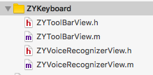

# ZYVoiceToWordTextViewDemo
语音转文字|UITextView|讯飞


使用方法:
1.下载讯飞SDK,替换iflyMSC.framework,添加相关类库(如不清楚请查看官方文档http://www.xfyun.cn/doccenter/iOS)

2.将ZYKeybroad文件夹导入


3.在ZYVoiceRecognizerView.m中修改appid
```
//  ZYVoiceRecognizerView.m

#pragma mark - 讯飞 func
/**
设置识别参数
****/
-(void)initRecognizer
{
    NSString *initString = @"appid= ";
    ....
}

```


